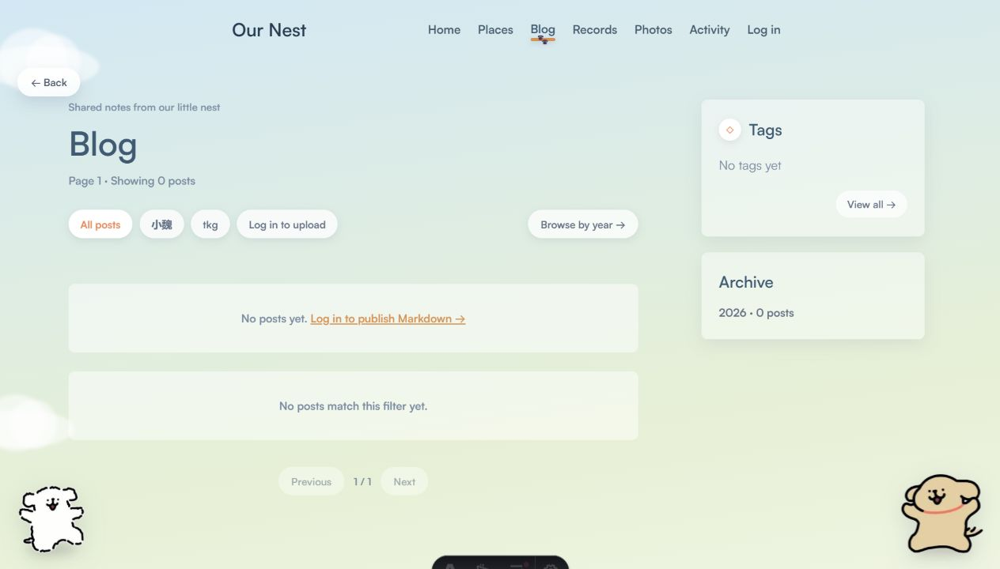
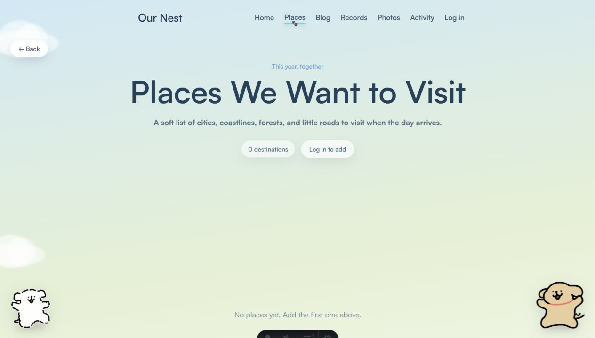
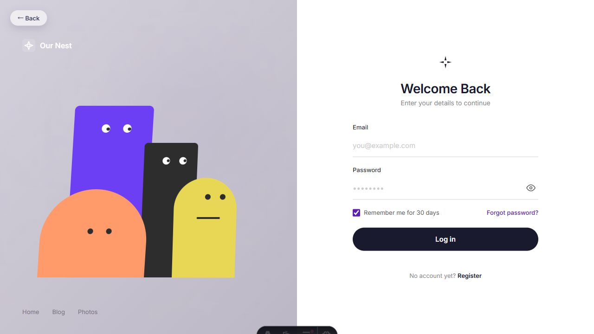

# 我们的小窝 · Our Nest

一个给两个人认真生活、慢慢记录的小网站。

它不是传统意义上的技术博客，也不是冷冰冰的后台系统。「我们的小窝」更像一间柔软的线上房间：可以写文章、存照片、记当天的小事、看一天的时间花到哪里，也可以把今年想去的地方一点点攒起来。


## 项目亮点

- **双人身份系统**：两位作者分别由白狗和棕狗代表，拥有独立颜色、昵称、状态与内容归属。
- **柔和插画风界面**：云朵背景、玻璃质感导航、角落小狗、漂浮小幽灵，让整个站点像一间可爱的共享小屋。
- **内容真实来自 Supabase**：文章、照片、生活记录、活动、地点、评论都走数据库和 Storage，不是静态演示页。
- **Markdown 博客发布**：登录后可以上传 `.md` / `.markdown` 文件，自动解析 frontmatter、标签、摘要和正文。
- **生活记录 + 照片联动**：同一天、同一作者上传的照片会自动出现在对应生活记录里。
- **照片墙与 3D 灯箱**：照片按日期分组，点进详情后可用切片翻转灯箱浏览。
- **一天活动可视化**：用 7 个时间段记录当天活动，自动生成分类占比环形图和时段概览。
- **首页今日状态**：展示双方今日心情、正在做的事和本地天气，让访客一眼看到两个人的当下。
- **评论系统**：博客文章和生活记录都可以留言，适合两个人互相补充和回应。
- **Vercel + Supabase 部署**：Astro SSR 部署在 Vercel，数据和存储托管在 Supabase。

## 页面截图

### 首页

首页是整个小窝的入口：包含双方状态、天气、心情、最近照片、最近文章、想去的地方等信息。Recent Photos 和 Places 只展示真实上传的数据，不再混入默认样例。


### 双人博客

博客页支持文章列表、作者筛选、标签筛选、按年份归档入口，以及登录后的 Markdown 上传。



文章详情页会把 Markdown 按二级标题切成阅读区块，并生成 TOC、阅读进度和评论区。

### 生活记录

生活记录是便签式时间线：按日期分组，记录心情、当天发生的事，并把同一天的照片自动串起来。


### 照片墙

照片墙按拍摄日期聚合照片。上传后会形成照片摞，进入详情后可以网格浏览；灯箱使用 3D 切片翻转效果。


### 今年想去

Places 用来保存今年想去的地方。每个地点有名称、简短愿望和视觉氛围 tone，例如 Starlight、Sunset、Forest、Seaside。



### 时段活动

Activity 用 7 个时间段记录一天：Early Morning、Morning、Noon、Afternoon、Dusk、Evening、Late Night。右侧会自动汇总分类占比和时段使用情况。


### 登录注册

登录页使用独立的动画角色界面，和主要内容页区分开：更像一个进入小窝前的小门厅。



## 功能总览

| 模块 | 路由 | 功能 |
|---|---|---|
| 首页 | `/` | 欢迎封面、双人状态、天气、最近照片、最近文章、最近地点 |
| 双人博客 | `/blog` | 文章列表、作者筛选、标签筛选、Markdown 上传入口 |
| 博客详情 | `/blog/[slug]` | Markdown 渲染、TOC、阅读进度、评论、删除自己的文章 |
| 生活记录 | `/records` | 按天分组的便签时间线、心情、照片联动、评论 |
| 照片墙 | `/photos` | 按日期分组、照片上传、详情网格、3D 灯箱、删除自己的照片 |
| 时段活动 | `/activity` | 日期切换、作者切换、活动新增、环形图、时段统计 |
| 今年想去 | `/places` | 地点新增、tone 氛围卡片、删除自己的地点 |
| 后台 | `/admin` | 汇总上传与管理入口：照片、博客、记录、活动 |
| 登录 | `/auth/login` | 邮箱密码登录、记住登录、跳转回来源页面 |
| 注册 | `/auth/register` | 限定双人邮箱注册，自动绑定白狗/棕狗身份 |

## 技术栈

| 层 | 选型 |
|---|---|
| 前端框架 | Astro 6，SSR 模式 |
| 部署适配器 | `@astrojs/vercel` |
| 数据库 / Auth / Storage | Supabase |
| 包管理 | npm + `package-lock.json` |
| 语言 | Astro、TypeScript、原生浏览器 JS |
| 样式 | 纯 CSS，按页面拆分到 `public/styles` |
| 字体 | Satoshi Variable，本地放在 `public/fonts` |

## 架构简图

```text
浏览器
  ↓ HTTPS
Vercel Serverless Function (sin1)
  ↓ Astro SSR
Supabase
  ├─ Auth：邮箱密码登录
  ├─ Postgres：profiles / blog_posts / photos / life_records / activity_entries / places / comments
  └─ Storage：photos / blog-markdown
```

Vercel 函数区域固定在 `sin1`，用于靠近 Supabase 项目所在区域，减少服务端读取数据时的延迟。

## 目录结构

```text
astro/
├── public/
│   ├── assets/          # 首页、草地、小狗等图片素材
│   ├── fonts/           # Satoshi 字体
│   ├── gif/             # 小狗待机与动作动图
│   ├── scripts/         # 前端交互脚本
│   └── styles/          # 页面与共享样式
├── src/
│   ├── layouts/         # PrototypeLayout / BaseLayout
│   ├── lib/             # Supabase、auth、markdown、types 等工具
│   ├── pages/           # 页面路由和 API endpoints
│   └── middleware.ts    # 全局认证与 locals 注入
├── supabase/
│   └── migrations/      # 数据库迁移 SQL
├── docs/
│   └── screenshots/     # README 截图
├── astro.config.mjs
├── vercel.json
├── package.json
└── README.md
```

## 数据模型

核心表都启用了 RLS，设计原则是：公开可读，登录用户只能写自己的内容。

| 表 | 作用 |
|---|---|
| `profiles` | 两位作者资料、身份、昵称、天气、今日心情和正在做的事 |
| `blog_posts` | Markdown 文章元数据、正文、标签和作者 |
| `photos` | 照片元数据、拍摄日期、Storage 路径和归属 |
| `life_records` | 每日生活记录、心情、正文 |
| `activity_entries` | 某天某时段的活动类型、分钟数、描述 |
| `places` | 今年想去的地方、理由、氛围 tone |
| `comments` | 博客和生活记录的评论 |

Storage buckets：

| Bucket | 公开 | 用途 |
|---|---|---|
| `photos` | 是 | 存放照片，前端直接使用公开 URL |
| `blog-markdown` | 否 | 备份上传的原始 Markdown 文件 |

## 本地开发

### 1. 安装依赖

```bash
npm install
```

### 2. 配置环境变量

复制 `.env.example` 为 `.env`，填入 Supabase 配置：

```text
SUPABASE_URL=https://your-project.supabase.co
SUPABASE_ANON_KEY=...
SUPABASE_SERVICE_ROLE_KEY=...
ALLOWED_SIGNUP_EMAILS=white@example.com,brown@example.com
```

`SUPABASE_SERVICE_ROLE_KEY` 只允许在 Astro 服务端使用，不要写进任何 `PUBLIC_` 环境变量，也不要暴露给浏览器。

### 3. 启动开发服务器

```bash
npm run dev
```

默认访问：

```text
http://localhost:4321
```

### 4. 生产构建检查

```bash
npm run build
```

推送前建议至少跑一次 build，避免 Vercel 部署时才发现模板或类型错误。

## Supabase 初始化

在 Supabase SQL Editor 中按顺序运行：

```text
supabase/migrations/001_initial_schema.sql
supabase/migrations/002_life_records.sql
supabase/migrations/003_activity_entries.sql
supabase/migrations/004_places.sql
supabase/migrations/005_profile_weather.sql
supabase/migrations/006_profile_status.sql
supabase/migrations/007_profile_location.sql
supabase/migrations/008_comments.sql
```

以后如果新增表或字段，请继续在 `supabase/migrations/` 下增加新的 SQL 文件，并手动到 Supabase Dashboard 跑一次。

## 双人注册规则

注册不是开放式社区注册，而是固定给两位作者使用。

当前注册接口会按邮箱映射身份：

```ts
const EMAIL_TO_AUTHOR = {
  "wjydyx0224@qq.com": "white",
  "2197322347@qq.com": "brown",
};
```

如果要换成新的邮箱，需要同步修改注册 API，并确认 Supabase Auth 中的用户状态。

## 上传与管理

登录后可以：

- 在 `/blog` 上传 Markdown 文章。
- 在 `/photos` 上传照片。
- 在 `/records` 写生活记录，并可附带多张照片。
- 在 `/activity` 给当天某个时段添加活动。
- 在 `/places` 添加想去的地方。
- 在 `/admin` 汇总管理自己的文章、照片、记录和活动。

删除操作只允许删除自己的内容。前端会显示确认弹窗，后端也会根据 `locals.user` 和记录归属校验。

## Markdown 支持

项目内置了轻量 Markdown 渲染器，支持：

- frontmatter：`title`、`excerpt`、`tags`
- 标题：`#`、`##`、`###` 等
- 段落、列表、引用、分割线
- 表格、任务列表
- 代码块和行内代码
- 粗体、斜体、删除线
- 链接和图片

文章详情页会按 `##` 二级标题切分为 `article-section`，用于生成 TOC 和滚动高亮。

## 部署

项目适合直接部署到 Vercel。

1. GitHub 连接 Vercel 项目。
2. 在 Vercel Project Settings 中配置环境变量。
3. 确认 `vercel.json` 中的 region：

```json
{
  "regions": ["sin1"]
}
```

4. 推送到 GitHub 后由 Vercel 自动部署。

常用流程：

```bash
npm run build
git add .
git commit -m "更新小窝"
git push
```

## 注意事项

- 本地 `.env` 如果指向生产 Supabase，那么本地新增/删除的数据也会影响线上数据。
- `.env` 已在 `.gitignore` 中，绝对不要提交真实密钥。
- 图片当前直接使用原图公开 URL，后续可以考虑上传时生成缩略图。
- 大文件上传现在经过 Vercel 中转，未来可以改为浏览器直传 Supabase signed upload URL。
- 登录页是独立 HTML，不走主 layout，这是为了保留动画角色登录页的完整视觉。

## 后续可以继续做的事

- RSS / sitemap。
- 博客全文搜索。
- 按年/月归档。
- 照片缩略图与压缩。
- 独立 dev Supabase 环境，避免本地开发影响生产数据。
- 更完整的移动端横屏适配。

## 一句话

「我们的小窝」想做的不是一个功能堆满的站点，而是一个两个人愿意一直打开、一直记录的小地方。
